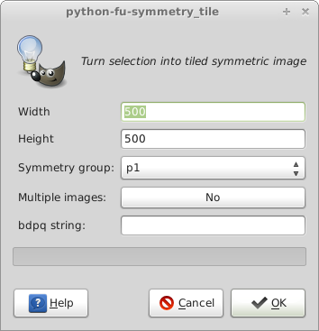
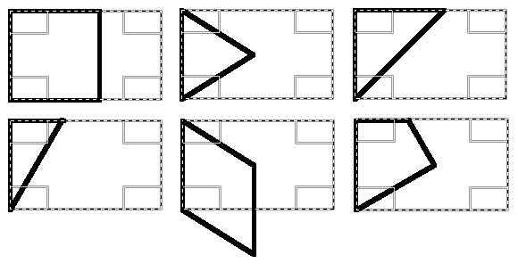
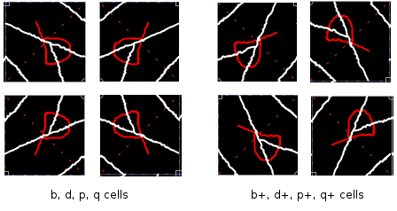
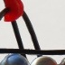
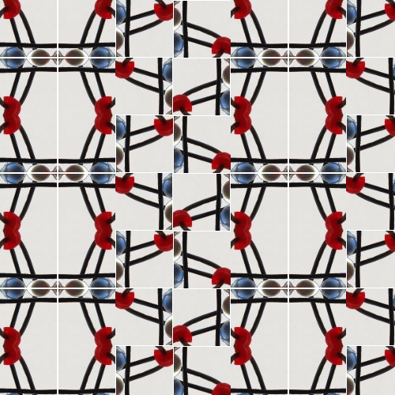

#Symmetry Tile plug-in for GIMP#

This plug-in takes the selection from an image ("cell") and produces a new image according to 
one of the [17 plane symmetry groups ](http://en.wikipedia.org/wiki/Wallpaper_groups). These are also known as wallpaper groups or plane crystallographic groups. 

Basically it rotates and or flips copies of the cell, combines them to form a tile and then copies that tile to fill a new image.

Some galleries of images produced with this plug-in can be found here.

##Installation##

From within GIMP find out where your plug-in directory is:

Edit>Preferences>Folders>Plug-ins

For Linux the plug-in directory  will be `~\.gimp-2.8\plugins`
Copy the file `symmetry_tile.py` to this folder and make it "executable". To do this: select the plug-in from your file browser, click properties and check the box "Allow executable" under the permissions tab.

For Windows the plug-in directory will be 

##Usage##

Select an area on an image using the rectangle select tool.
Start the plug-in via `Filters>Render>Symmetry Tile

You should see the following dialog. 



The `Height` and `Width` parameters determine the size of the new image.
The `Symmetry group` drop down gives you the choice of one of the 17 symmetry groups p1, p2 through to p6m. The last three entries I'll cover later. 

The `Multiple Images` toggle is set by default to `No`. In this mode it produces one image for the chosen symmetry group. Some groups (p2, pm, cm, cmm, pg, pgg, pmg, p4, p4g, p6) can produce different patterns depending on, for example, which corner of the cell a copy is rotated around to form the tile. If the `Multiple Images` toogle is set to `Yes`, a separate image is produced for each of these different patterns.

The `bdpq string` entry box is covered below under Escher's Potato Game.

###Deriving the initial cell###

Many of the symmetry groups can be produced from a rectangular cell (p1, p2, pm, cm, cmm, pg, pgg, pmg, pmm). These groups use the user selection unmodified. Some groups (p4, p4g) require an initial square cell. In this case, a square primary cell is derived from the user's initial rectangular selection. The left most side of the rectangle is used as the left edge of the square.

Two groups (p3m1, p6) are produced from a equilateral triangle shaped cell. This cell is derived from the user's rectangular selection with the triangle sharing the rectangle's left side, and the triangle pointing to the right.

The p4m group requires a half square triangle for the initial cell.  The left most side of the user's rectangle is used as the left edge of the triangle, with the rectangle and triangle sharing the top left corner.

The p6m group requires a triangle with internal angles of 90, 60 and 30 degrees for the initial cell. The left most side of the rectangle is used as the left longer edge of the triangle, with the rectangle and triangle sharing the top left corner. 

The p3 group needs a diamond shape (rhombus) with internal angles of 30 and 60 degrees for the initial cell. The diamond shares the rectangle's left side and the diamond points down and to the right.

The p31m group uses a kite shape for the initial cell. The kite shares the rectangle's left side and the top left corner.

The figure below  illustrates this, with the user's rectangular selection shown as a dotted line and the derived initial cell as a solid line.



##Last 3 Symmetry group options###

The `17 groups` option makes all the patterns from the same user selection. If `Multiple Images` is set to `No` this will produce 17 images. If it is set to `Yes`, 40 images will be produced. Depending on your machine's capability its probably not a good idea to make 40 very large images!

The `all square cells` option derives a square cell and uses it for all the groups that can be made with a square cell. There are 11 images produced without `Multiple Images` set and 32 images when `Multiple Images` is set.

`Escher's Potato Game` is briefly described [here](http://www.eschertiles.com/index.html) along with an interactive app. This paper [(pdf)](http://www.combinatorics.org/Volume_4/PDF/v4i2r17.pdf) by Doris Schattschneider describes the idea more fully. In the Symmetry Tile plug-in, if the `bdpq string` entry is left blank, choosing the `Escher's Potato Game` option will produce from the user's selection a random pattern conforming to the rules of the Potato Game.

If the `bdpq string` entry is filled with an appropriate string that string will be used to construct an image from the user's selection.

###How to write a bdpq string###
The "bdpq" notation is a useful shorthand to describe patterns built from square and rectangular cells.
 
The `bdpq string` entry takes a string similar  to `bq|qb` and builds a tile for a pattern based on the user selected rectangular cell.
    
    The syntax for the string:  
        b  is the original user selected cell
        d is the cell flipped horizontally  
        p is the cell flipped vertically  
        q is the cell rotated 180 deg  
       
        | denotes a new line  
        
    That is 'bq|qb' will build this tile   
    
    bq  
    qb  
    
    and hence this pattern (symmetry group p2) 
    
    bqbqbq
    qbqbqb
    bqbqbq
    qbqbqb
    
    b+, d+, p+, q+  represent each cell rotated 90 deg (clockwise), 

If the original user selection contains the letter 'b', then if the cell is flipped around a vertical axis it will look like the letter 'd'. If the letter 'b' is flipped around the horizontal axis it will look like the letter 'p'. if the letter 'b' is rotated 180 degrees it will look like the letter 'q'. (this depends a bit on the font of course).

If the original cell is square then 90 degree rotations of copies of it can also be used to build a tile from the cell. Unfortunately there are no suitable letters to easily describe these and I've chosen to call these cells 'b+', 'd+', 'p+' and 'q+'. Each is the respective cell rotated 90 degrees clockwise.

The eight different variations of the original tile are shown here.



The string can be arbitrarily long, but each row should have the same number of cells. The plug-in does not check to see whether the bdpq string is properly formed. Odd results will probably occur for odd strings.

If the `bdpq string` entry is blank when the `Escher's Potato Game` option is chosen the plug-in will make up a tile from  4 cells in 2 rows of 2. Each cell will be picked from a random selection of the b, b+, d, d+, p, p+, q, q+ transformations of the original selection. The string used can be seen in the file name of the new image. (the '+' sign is replaced by a 't' and the '|' by a 'l')

As an example this initial cell.



and the string `bdb+d+|pqp+q+` produces this pattern



###Extra tip:###

If after generating 40 images you want to save them all, here is some code to type into the python console. (Filters>Python-Fu>Console)

```
for img in gimp.image_list():
   new_name = "/tmp/" + img.name[:-4] + ".png"
   pdb.gimp_file_save(img, img.layers[0], new_name, new_name)
```
